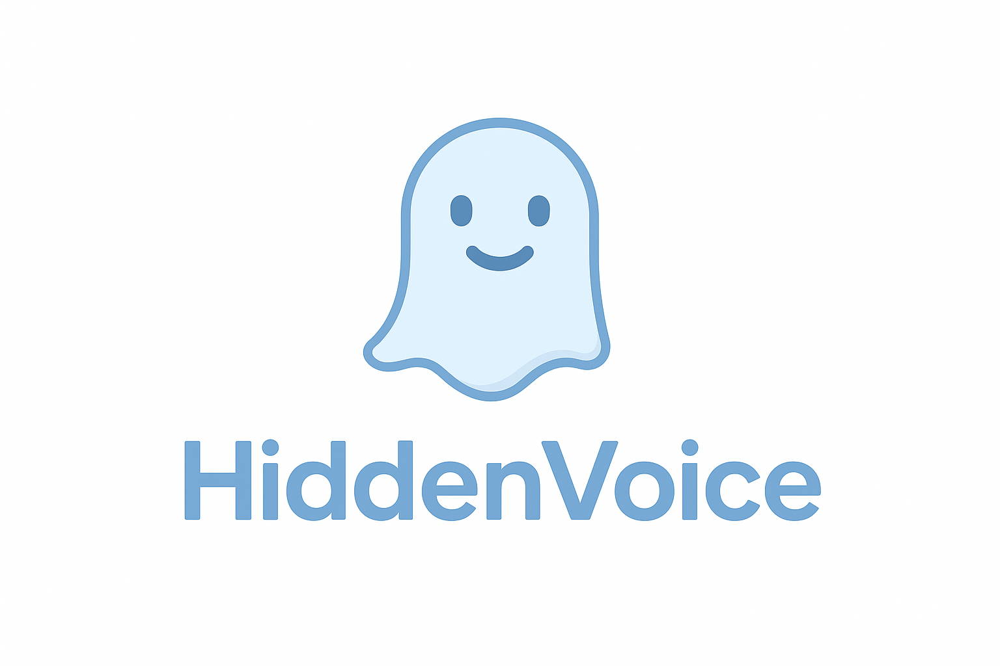

	
	<h1>HiddenVoice</h1>
	<h2>Speak freely. Grow together.</h2>

---

# Index

- [English](#english)
- [Português](#português)

---

# English

## 👻 HiddenVoice

**HiddenVoice** is an **anonymous feedback** platform designed to give voice to people within **teams, companies, and communities**.  
Often, great ideas, constructive criticism, or even important issues go unshared due to fear of exposure.  
With HiddenVoice, everyone can express themselves **safely, confidentially, and free from judgment**.

---

## Purpose

Our goal is to **strengthen communication** within groups and organizations, creating a space where everyone feels their opinion matters.  
HiddenVoice allows leaders to receive valuable insights and members to contribute without fear, helping to build a healthier, more inclusive, and transparent environment.

---

## How it works

1. **Create a space** for your community or team.
2. **Share the link** with members.
3. **Receive anonymous feedback**, which can be organized by categories.
4. **Analyze insights** and use them to improve communication and the collective environment.

---

## Who is HiddenVoice for?

- **Work teams** looking to improve internal collaboration.
- **Online communities** that want to hear from their members openly.
- **Companies** seeking a more honest communication channel.
- **Any group** that values sincere opinions and wants to give everyone a voice.

---

## Values

- **Anonymity**: no one will be identified when sending feedback.
- **Trust**: a safe space to share ideas and concerns.
- **Clarity**: leaders receive direct and organized information.
- **Growth**: feedback builds stronger teams and communities.

---

## Why "HiddenVoice"?

Because we believe that **voices that are not heard** also have power.  
HiddenVoice gives a stage to what is often hidden — whether it's a suggestion, a criticism, or a brilliant idea.

---

✨ Your voice matters, even in silence.

---

# Português

## HiddenVoice

O **HiddenVoice** é uma plataforma de **feedback anônimo** criada para dar voz a pessoas dentro de **times, empresas e comunidades**.  
Muitas vezes, boas ideias, críticas construtivas ou até problemas importantes deixam de ser compartilhados por medo de exposição.  
Com o HiddenVoice, todos podem se expressar de forma **segura, confidencial e livre de julgamentos**.

---

## Propósito

Nosso objetivo é **fortalecer a comunicação** dentro de grupos e organizações, criando um espaço onde cada pessoa sinta que sua opinião importa.  
O HiddenVoice permite que líderes recebam insights valiosos e que membros contribuam sem receio, ajudando a construir um ambiente mais saudável, inclusivo e transparente.

---

## Como funciona

1. **Crie um espaço** para sua comunidade ou time.
2. **Compartilhe o link** com os membros.
3. **Receba feedbacks anônimos**, que podem ser organizados por categorias.
4. **Analise os insights** e utilize-os para melhorar a comunicação e o ambiente coletivo.

---

## Para quem é o HiddenVoice?

- **Times de trabalho** que buscam melhorar a colaboração interna.
- **Comunidades online** que querem ouvir seus membros de forma aberta.
- **Empresas** que desejam ter um canal de comunicação mais honesto.
- **Qualquer grupo** que valorize opiniões sinceras e queira dar voz a todos.

---

## Valores

- **Anonimato**: ninguém será identificado ao enviar feedback.
- **Confiança**: um espaço seguro para compartilhar ideias e preocupações.
- **Clareza**: líderes recebem informações diretas e organizadas.
- **Crescimento**: feedbacks constroem times e comunidades mais fortes.

---

## Por que "HiddenVoice"?

Porque acreditamos que **as vozes que não são ouvidas** também têm poder.  
O HiddenVoice dá palco para aquilo que muitas vezes fica escondido — seja uma sugestão, uma crítica ou uma ideia brilhante.

---

✨ Sua voz importa, mesmo em silêncio.

## Propósito

Nosso objetivo é **fortalecer a comunicação** dentro de grupos e organizações, criando um espaço onde cada pessoa sinta que sua opinião importa.  
O HiddenVoice permite que líderes recebam insights valiosos e que membros contribuam sem receio, ajudando a construir um ambiente mais saudável, inclusivo e transparente.

---

## Como funciona

1. **Crie um espaço** para sua comunidade ou time.
2. **Compartilhe o link** com os membros.
3. **Receba feedbacks anônimos**, que podem ser organizados por categorias.
4. **Analise os insights** e utilize-os para melhorar a comunicação e o ambiente coletivo.

---

## Para quem é o HiddenVoice?

- **Times de trabalho** que buscam melhorar a colaboração interna.
- **Comunidades online** que querem ouvir seus membros de forma aberta.
- **Empresas** que desejam ter um canal de comunicação mais honesto.
- **Qualquer grupo** que valorize opiniões sinceras e queira dar voz a todos.

---

## Valores

- **Anonimato**: ninguém será identificado ao enviar feedback.
- **Confiança**: um espaço seguro para compartilhar ideias e preocupações.
- **Clareza**: líderes recebem informações diretas e organizadas.
- **Crescimento**: feedbacks constroem times e comunidades mais fortes.

---

## Por que "HiddenVoice"?

Porque acreditamos que **as vozes que não são ouvidas** também têm poder.  
O HiddenVoice dá palco para aquilo que muitas vezes fica escondido — seja uma sugestão, uma crítica ou uma ideia brilhante.

---

✨ Sua voz importa, mesmo em silêncio.

---
